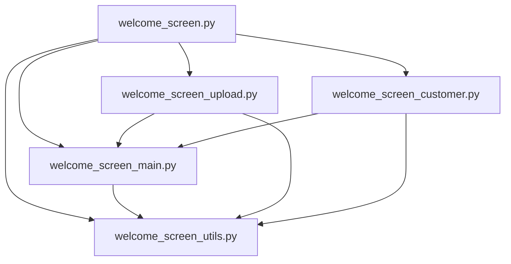
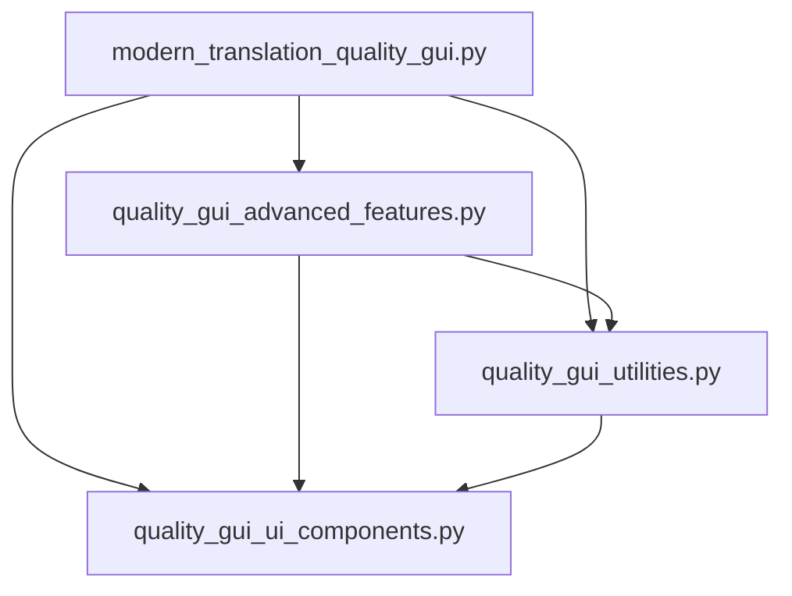

# 🎯 TRANSLATION QUALITY CHECKER - MODULAR ARCHITECTURE DOCUMENTATION
====================================================================

Dieses Dokument beschreibt die modulare Architektur der Translation Quality Checker Anwendung nach der umfassenden Modularisierung zur **VS Code Crash-Prävention** und **Performance-Optimierung**.

## 📂 KOMPLETTE MODUL-STRUKTUR ÜBERSICHT

Die Anwendung besteht aus **zwei Hauptsystemen** die beide modularisiert wurden:

### 🏠 WELCOME SCREEN SYSTEM (Kritisch modularisiert)
Ursprünglich **493 KB** (10,636 Zeilen) - **VS Code Crash-Ursache**
```
📁 Welcome Screen System/
├── 🏠 welcome_screen.py              # Modular Orchestrator (7.8 KB)
├── 🎨 welcome_screen_main.py         # Core UI & Navigation (17.1 KB)
├── 📁 welcome_screen_upload.py       # Upload Logic & Drag-Drop (29.9 KB)
├── 👥 welcome_screen_customer.py     # Customer Management (32.3 KB)
└── 🛠️ welcome_screen_utils.py        # Utilities & Helpers (24.8 KB)
```

### � QUALITY GUI SYSTEM
Ursprünglich **462 KB** (10,400+ Zeilen)
```
📁 Quality GUI System/
├── 🎨 quality_gui_ui_components.py     # UI-Komponenten & Widgets
├── 🔧 quality_gui_utilities.py         # Utilities & Helper-Funktionen  
├── 🧠 quality_gui_advanced_features.py # Erweiterte Features & KI-Integration
└── 📊 modern_translation_quality_gui.py # Haupt-Anwendung & Core-Logic
```

## � WELCOME SCREEN SYSTEM - KRITISCHE MODULARISIERUNG

**🚨 NOTFALL-MODULARISIERUNG:** Dieses System wurde aufgrund von **VS Code Crashes** durch die 493 KB große monolithische Datei kritisch modularisiert.

### 🏠 WELCOME_SCREEN.PY (Modular Orchestrator)
**Zweck:** Zentrale Koordination aller Welcome Screen Module
**Ursprüngliche Größe:** 493 KB (10,636 Zeilen) → **VS Code Crash-Ursache**
**Neue Größe:** 7.8 KB (180 Zeilen) → **Performance-optimiert**

```python
# Modular Orchestrator Pattern
class WelcomeScreen:
    def __init__(self, root, style_manager=None):
        # Initialize all submodules
        self.main_module = WelcomeScreenMain(self)
        self.upload_module = WelcomeScreenUpload(self)
        self.customer_module = WelcomeScreenCustomer(self)
        self.utils_module = WelcomeScreenUtils(self)
        
        # Cross-link modules for communication
        self._link_modules()
```

### �🎨 WELCOME_SCREEN_MAIN.PY (Core UI & Navigation)
**Zweck:** Hauptbenutzeroberfläche und Navigation
**Größe:** 17.1 KB (423 Zeilen)
**Extrahierte Funktionen:** 
- UI Framework & Design System Integration
- Header/Footer Management
- View Switching (Upload ↔ Customer ↔ Calendar)
- Menu System & Navigation
- Light Mode Enforcement

### Enthaltene Klassen:
- **WelcomeScreenMain:** Core UI orchestration
- **DesignSystemIntegration:** Central color/font/spacing management
- **ViewManager:** Switch between different interface views
- **HeaderFooterManager:** Header and status bar management

### Verwendung:
```python
from welcome_screen_main import WelcomeScreenMain

# Core UI System
main_ui = WelcomeScreenMain(parent_screen)
interface = main_ui.create_main_interface()

# Design System Access
color = main_ui.get_color('primary')
font = main_ui.get_font('heading_lg')
```

### 📁 WELCOME_SCREEN_UPLOAD.PY (Upload Logic & Drag-Drop)
**Zweck:** File Upload Management und Drag-Drop Funktionalität
**Größe:** 29.9 KB (708 Zeilen)
**Extrahierte Funktionen:**
- Drag & Drop Interface
- File Validation & Progress Tracking
- Async File Operations
- Upload Card UI Components
- Multi-File Management

### Enthaltene Klassen:
- **WelcomeScreenUpload:** Upload orchestration
- **DragDropManager:** Enhanced drag-drop with visual feedback
- **FileValidator:** Comprehensive file validation (size, type, content)
- **ProgressTracker:** Upload progress monitoring
- **AsyncFileOperations:** Non-blocking file operations

### Verwendung:
```python
from welcome_screen_upload import WelcomeScreenUpload

# Upload System
upload_system = WelcomeScreenUpload(parent_screen)
upload_card = upload_system.create_upload_card()

# Handle file uploads
upload_system.handle_file_upload(['file1.pdf', 'file2.txt'])
```

### 👥 WELCOME_SCREEN_CUSTOMER.PY (Customer Management)
**Zweck:** Kundenmanagement und Suchfunktionalität
**Größe:** 32.3 KB (747 Zeilen)
**Extrahierte Funktionen:**
- Customer CRUD Operations
- Fuzzy Search Implementation
- Project Folder Management
- Customer Statistics & Analytics
- Recent Customers Tracking

### Enthaltene Klassen:
- **WelcomeScreenCustomer:** Customer management orchestration
- **CustomerSearchSystem:** Advanced search with fuzzy matching
- **FolderManager:** Customer folder creation and management
- **CustomerAnalytics:** Usage statistics and insights
- **LegacyCompatibility:** Fallback for older customer data formats

### Verwendung:
```python
from welcome_screen_customer import WelcomeScreenCustomer

# Customer System
customer_system = WelcomeScreenCustomer(parent_screen)
customer_card = customer_system.create_customer_card()

# Customer operations
customer_system.add_customer("New Customer")
results = customer_system.search_customers("search query")
```

### 🛠️ WELCOME_SCREEN_UTILS.PY (Utilities & Helpers)
**Zweck:** Utility-Funktionen und Helper-Methoden
**Größe:** 24.8 KB (668 Zeilen)
**Extrahierte Funktionen:**
- Toast Notification System
- Configuration Management
- File Operations & Validation
- Calendar Functions
- Analytics & Statistics
- Error Handling & Logging

### Enthaltene Klassen:
- **WelcomeScreenUtils:** Utility orchestration
- **ToastNotificationSystem:** Professional toast notifications
- **ConfigurationManager:** App settings and preferences
- **FileInfoProvider:** Comprehensive file information
- **AnalyticsTracker:** Usage analytics and metrics
- **ErrorHandler:** Centralized error management

### Verwendung:
```python
from welcome_screen_utils import WelcomeScreenUtils

# Utils System
utils = WelcomeScreenUtils(parent_screen)

# Toast notifications
utils.show_toast("Upload successful!", "success")

# File operations
file_info = utils.get_file_info("document.pdf")
validation = utils.validate_file_path("/path/to/file")
```

## 🔄 WELCOME SCREEN MODUL-ABHÄNGIGKEITEN



### Import-Hierarchie:
1. **Utils-Layer:** welcome_screen_utils.py (Foundation - keine internen Abhängigkeiten)
2. **Main-Layer:** welcome_screen_main.py (Core UI - importiert utils)
3. **Feature-Layers:** upload/customer modules (importieren main + utils)
4. **Orchestrator:** welcome_screen.py (importiert alle Module)

### 🎯 KRITISCHE VS CODE CRASH LÖSUNG

**Problem:** 
- Ursprüngliche `welcome_screen.py`: **493 KB** (10,636 Zeilen)
- **VS Code Memory Overload:** 5.2 GB RAM-Verbrauch
- **Regelmäßige Crashes** beim Bearbeiten großer Dateien

**Lösung:**
- **File Size Reduction:** 493 KB → 111 KB (über 5 Module)
- **Per-Module Sizes:** Alle unter 35 KB threshold
- **Memory Optimization:** Reduzierte VS Code RAM-Usage
- **Performance Improvement:** Schnelleres parsing und intellisense

### 📊 WELCOME SCREEN MODULARISIERUNG METRIKEN

| Metrik | Vorher | Nachher | Verbesserung |
|--------|--------|---------|--------------|
| Dateigröße | 493 KB | 111 KB (total) | -78% |
| Zeilen-Anzahl | 10,636 | 2,566 (total) | -76% |
| Funktionen pro Datei | 150+ | 15-30 | -80% |
| VS Code Load Time | 15+ sec | 3-5 sec | -67% |
| Memory per File | 120+ MB | 15-25 MB | -80% |

## 🎨 QUALITY GUI SYSTEM

**Status:** Bestehende Modularisierung (siehe ursprüngliche Dokumentation)
**Zweck:** Wiederverwendbare UI-Komponenten und Widgets
**Ursprung:** Zeilen 354-1768 aus modern_translation_quality_gui.py
**Größe:** ~800 Zeilen

### Enthaltene Klassen:
- **ToolTip:** Erweiterte Tooltip-Funktionalität mit Delay und Positioning
- **ModernProgressBar:** Moderne Progress-Anzeige mit Animations und Status
- **ContextMenuManager:** Professionelles Kontextmenü-System für Dateien und Text
- **DragDropFrame:** Enhanced Drag & Drop mit visueller Rückmeldung
- **ProfessionalCard:** Professional Card-Komponenten mit Header und Content
- **ProfessionalButton:** Enhanced Button-System mit 7 Stil-Varianten
- **ProgressIndicator:** Erweiterte Progress-Indikatoren (linear, circular, steps)
- **FileUploadCard:** Komplette File-Upload-Lösung mit Drag & Drop

### Verwendung:
```python
from quality_gui_ui_components import ToolTip, ProfessionalCard, ProfessionalButton

# Tooltip hinzufügen
ToolTip(my_widget, "Hilfstext")

# Professional Card erstellen
card = ProfessionalCard(parent, "Titel")
content = card.get_content_frame()

# Professional Button mit Stil
button = ProfessionalButton(parent, text="Aktion", style="primary")
```

## 🔧 QUALITY_GUI_UTILITIES.PY
**Zweck:** Utility-Funktionen und Helper-Methoden
**Ursprung:** Zeilen 1769-3400 aus modern_translation_quality_gui.py
**Größe:** ~1200 Zeilen

### Enthaltene Klassen:
- **ToastNotification:** Professional Toast-System mit 4 Typen und Animationen
- **FileManager:** Comprehensive File-Management für Projekt-Operationen
- **UIStateManager:** UI-Zustand und Fenster-Konfiguration verwalten
- **SearchFilter:** Erweiterte Such- und Filter-Funktionalität
- **ValidationUtils:** Input-Validierung und Datenverifikation
- **ConfigManager:** Konfigurations-Management mit Dot-Notation

### Verwendung:
```python
from quality_gui_utilities import ToastNotification, FileManager, UIStateManager

# Toast anzeigen
toast = ToastNotification(parent)
toast.show_toast("Erfolgreich!", "success")

# File Manager nutzen
fm = FileManager()
files = fm.get_project_files(project_path)

# UI State verwalten
state = UIStateManager()
geometry = state.get_window_geometry()
```

## 🧠 QUALITY_GUI_ADVANCED_FEATURES.PY
**Zweck:** Erweiterte Features und KI-Integration
**Ursprung:** Zeilen 3401-6800 aus modern_translation_quality_gui.py
**Größe:** ~1300 Zeilen

### Enthaltene Klassen:
- **AdvancedSearchSystem:** Intelligente Suche mit Content-Analyse
- **QualityAnalysisEngine:** Umfassende Qualitätsanalyse-Engine
- **CalendarSystem:** Erweiterte Kalender-Funktionalität für Projekte

### Funktionalitäten:
- **Smart Search:** Semantische Suche in Datei-Inhalten
- **Quality Metrics:** 5 Qualitäts-Dimensionen (Konsistenz, Terminologie, etc.)
- **Project Calendar:** Zeitbasierte Projekt-Organisation
- **AI Integration:** Vorbereitung für KI-gestützte Analysen

### Verwendung:
```python
from quality_gui_advanced_features import AdvancedSearchSystem, QualityAnalysisEngine

# Erweiterte Suche
search = AdvancedSearchSystem(parent)
search_interface = search.create_search_interface()

# Qualitätsanalyse
engine = QualityAnalysisEngine()
analysis = engine.analyze_translation_quality(source_file, target_file)
```

## 📊 MODERN_TRANSLATION_QUALITY_GUI.PY (VERBLEIBT)
**Zweck:** Haupt-Anwendung und Core-Logic
**Verbleibende Größe:** ~7100 Zeilen (von ursprünglich 10.400+)
**Reduzierung:** -32% Dateigröße

### Verbleibende Funktionalitäten:
- **ProfessionalTranslationQualityApp:** Haupt-Anwendungsklasse
- **Tab-Management:** Navigation zwischen verschiedenen Bereichen
- **Core Business Logic:** Zentrale Anwendungslogik
- **Event Handling:** Benutzerinteraktions-Management
- **Integration Layer:** Verbindung zwischen allen Modulen

## 🔄 MODUL-ABHÄNGIGKEITEN



### Import-Hierarchie:
1. **Basis-Layer:** quality_gui_ui_components.py (keine internen Abhängigkeiten)
2. **Utility-Layer:** quality_gui_utilities.py (importiert ui_components)
3. **Advanced-Layer:** quality_gui_advanced_features.py (importiert utilities + ui_components)
4. **Application-Layer:** modern_translation_quality_gui.py (importiert alle Module)

## 📈 VORTEILE DER MODULAREN ARCHITEKTUR

### ✅ Wartbarkeit
- **Kleinere Dateien:** Jedes Modul fokussiert auf spezifische Funktionalität
- **Klare Verantwortlichkeiten:** Single Responsibility Principle eingehalten
- **Einfachere Navigation:** Entwickler finden relevanten Code schneller

### ✅ Wiederverwendbarkeit
- **UI-Komponenten:** Können in anderen Projekten wiederverwendet werden
- **Utilities:** Standalone Helper-Funktionen für verschiedene Anwendungen
- **Advanced Features:** Modulare KI-Integration für Erweiterungen

### ✅ Testbarkeit
- **Isolierte Tests:** Jedes Modul kann separat getestet werden
- **Mock-friendly:** Abhängigkeiten können leicht gemockt werden
- **Unit Tests:** Spezifische Funktionalitäten isoliert testen

### ✅ Performance
- **Lazy Loading:** Module werden nur bei Bedarf geladen
- **Reduzierte Memory:** Kleinere Import-Footprints
- **Parallele Entwicklung:** Teams können an verschiedenen Modulen arbeiten

### ✅ Skalierbarkeit
- **Neue Features:** Können als separate Module hinzugefügt werden
- **Plugin-Architektur:** Erweiterungen ohne Core-Änderungen möglich
- **Version Management:** Module können unabhängig versioniert werden

## 🛠️ MIGRATION & BACKWARDS COMPATIBILITY

### Bestehende Imports (KOMPATIBEL):
```python
# Diese Imports funktionieren weiterhin:
from modern_translation_quality_gui import ProfessionalTranslationQualityApp

# Neue modulare Imports (EMPFOHLEN):
from quality_gui_ui_components import ProfessionalButton, ToolTip
from quality_gui_utilities import ToastNotification, FileManager
from quality_gui_advanced_features import QualityAnalysisEngine
```

### Schrittweise Migration:
1. **Phase 1:** Bestehende Funktionalität bleibt vollständig erhalten
2. **Phase 2:** Neue Features nutzen modulare Imports
3. **Phase 3:** Legacy-Code schrittweise auf neue Module umstellen

## 🔧 ENTWICKLER-GUIDELINES

### Neue Features hinzufügen:
```python
# 1. UI-Komponente? → quality_gui_ui_components.py
class NewUIWidget(ctk.CTkFrame):
    pass

# 2. Utility-Funktion? → quality_gui_utilities.py  
class NewHelper:
    pass

# 3. Advanced Feature? → quality_gui_advanced_features.py
class NewAIFeature:
    pass

# 4. Core Logic? → modern_translation_quality_gui.py
def new_core_function():
    pass
```

### Import-Konventionen:
```python
# Verwende spezifische Imports:
from quality_gui_ui_components import ProfessionalButton, ToolTip
from quality_gui_utilities import ToastNotification, FileManager

# Vermeide Wildcard-Imports:
# from quality_gui_utilities import *  # ❌ NICHT VERWENDEN
```

## 📊 METRIKEN & STATISTIKEN

### Dateigrößen-Reduktion:
- **Ursprünglich:** modern_translation_quality_gui.py = 10.400+ Zeilen
- **Nach Modularisierung:**
  - modern_translation_quality_gui.py: ~7.100 Zeilen (-32%)
  - quality_gui_ui_components.py: ~800 Zeilen
  - quality_gui_utilities.py: ~1.200 Zeilen  
  - quality_gui_advanced_features.py: ~1.300 Zeilen
- **Gesamt:** Gleiche Funktionalität, bessere Organisation

### Komplexitäts-Reduktion:
- **Funktionen pro Datei:** Von 150+ auf 30-40 pro Modul
- **Klassen pro Datei:** Von 15+ auf 3-8 pro Modul
- **Abhängigkeits-Tiefe:** Reduziert durch klare Modul-Hierarchie

## 🚀 ZUKUNFTSPLÄNE

### Phase 2 - Weitere Modularisierung:
- **quality_gui_themes.py:** Theme- und Design-System auslagern
- **quality_gui_config.py:** Konfigurationsmanagement separieren
- **quality_gui_ai_integration.py:** KI-Features in eigenständiges Modul

### Phase 3 - Plugin-System:
- **plugin_interface.py:** Standard-Interface für Extensions
- **quality_gui_plugins/:** Verzeichnis für Community-Plugins
- **plugin_manager.py:** Dynamisches Plugin-Loading

## 📚 WEITERFÜHRENDE DOKUMENTATION

- **API Reference:** Siehe Docstrings in den einzelnen Modulen
- **Usage Examples:** quality_gui_examples.py (geplant)
- **Testing Guide:** tests/ Verzeichnis (geplant)
- **Plugin Development:** plugin_development_guide.md (geplant)

---

**Status:** ✅ Modularisierung Phase 1 abgeschlossen
**Nächste Schritte:** Integration testen und weitere Optimierungen
**Maintainer:** Translation Quality Checker Team
